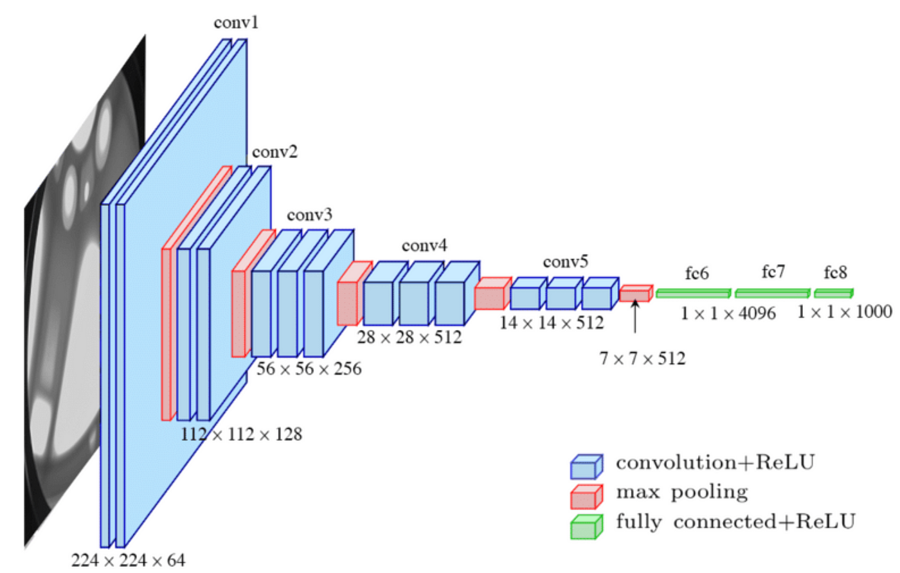

本项目采用VGG16对CIFAR10进行图像分类，旨在为初学者提供一个简单的pytorch入门项目
VGG是牛津大学视觉几何组在2014年提出的一种CNN架构，其是在AlexNet的基础上进一步增加网络深度、简化网络设计来提升模型性能

VGG16有16个卷积层、5个最大池化层以及3个全连接层，具有可调参数的层数为16，所以叫做VGG16
CIFAR10的图像尺寸为32*32，ImageNet的图像尺寸为224*224
在原论文中，使用的是3*224*224的ImageNet，因此经过features部分得到的是7*7*512，此时会首先进行展平，然后交由三个全连接层进行处理。classfier部分的参数量巨大，可以说占了90%的参数量
我们此处进行一个简化，CIFAR10的输入图像经过features部分得到1*1*512，而classfier部分我们简化到只使用一个全512->10的全连接层进行处理

进行训练
python3 train.py